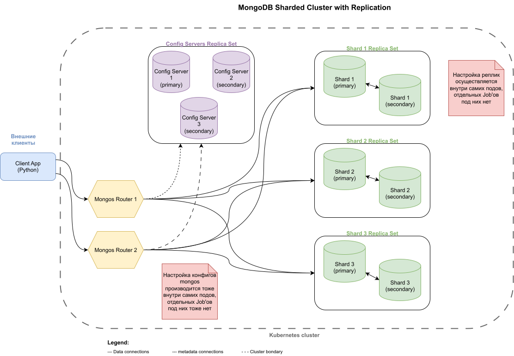

# Задание 1. Планированование

## 1.1. Шардирование

Моя минимальная конфигурация для шардированной MongoDB:
- отдельный mongos-роутер, на который приходят внешние запросы;
- отдельный конфиг-сервер с отдельной RS для конфигов;
- 3 шард-сервера (по одному на каждый RS);
- скрипты инициализации:
  - для шардов и и конфиг-сервера;
  - для mongos-роутера.

_Схема 1. Только шардирование_

## 1.2. Добавляем репликацию

Для реплицированной MongoDB я решил не мелочиться и также включить дублирование для конфиг-серверов и mongos-роутеров:
- 2 mongos-роутера;
- 3 конфиг-сервера (для кворума);
- 3 шарда (каждая с одной master-репликой и одной slave-репликой).

P.S. Поскольку в реальности мы весь серверный софт будем развёртывать на Kubernetes, 
то я попробую заморочиться и развернуться на кубере, применив что-нибудь из штатных helm chart'ов для Mongo, ~~не зря же нас такому учили~~

_Схема 2. Шардирование + репликация_

## 1.3. Добавляем кэширование
Раз уж мы начали такие извращения, то время добавить