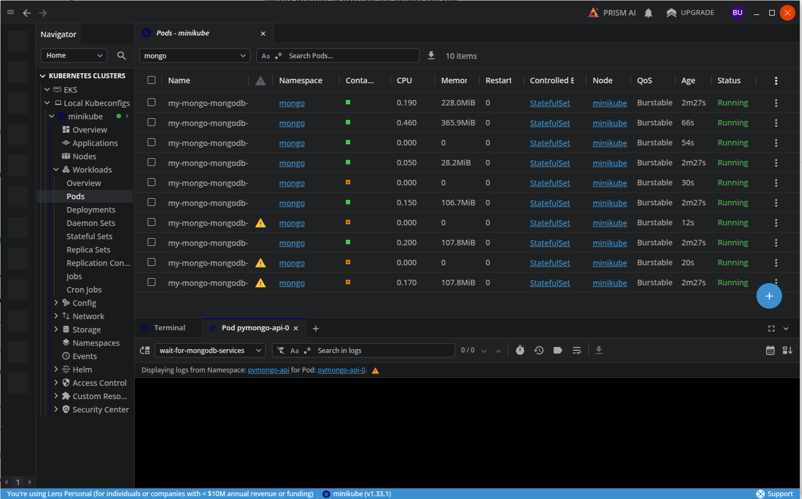

# Задание 3. Репликация

Здесь мы попробуем завестись не на docker-compose, как обычно, а сразу на kubernetes, как у взрослых мальчиков.
Для тестирования будем использовать minikube, shell-скрипты и YAML-спецификации для Kubernetes-ресурсов:
- `my-mongo-values.yaml` -- Values для helm chart'а `bitnami/mongodb-sharded`, где мы устанавливаем количество шардов, реплик, mongos-роутеров и другие параметры кластера;
- `mongo-services.yaml` -- kubernetes-манифест с NodePort для mongos-роутеров (и для всех остальных подов для отладки);
- `pymongo-api.yaml` -- kubernetes-манифест, который управляет развёртыванием нашего тестового приложения `pymongo-api` в Kubernetes (там сделан для него `StatefulSet`, `NodePort` и `ClusterRole`).
- `install.sh` -- основной скрипт установки:
  - создаём пространство mongo;
  - устанавливаем в него helm chart `bitnami/mongodb-sharded` с нужными параметрами; 
  - устанавливаем туда же `NodePort` из `mongo-services.yaml`;
  - создаём пространство `pymongo-api` и устанавливаем туда тестовое веб-приложение `pymongo_api`.
- `uninstall.sh` и `delete_minikube`

## Установка 

Запускаем minikube (хинт: возможно, вам проще запустить его с другим драйвером, например, vmware):

```bash
bash setup_minikube.sh
```

В конце должно вывестись:
```
Проверяем статус minikube:
minikube
type: Control Plane
host: Running
kubelet: Running
apiserver: Running
kubeconfig: Configured
```

Устанавливаем MongoDB и тестовое веб-приложение `pymongo-api`:

```bash
bash install.sh
kubectl wait --for=condition=Ready pod -l app=pymongo-api -n pymongo-api --timeout=600s 
```

Минут через 5 напечатает: `pod/pymongo-api-0 condition met`

Чтобы ждать было не скучно, можем пока открыть Lens, подключиться к minikube и посмотреть, как стартуют поды в пространствах `mongo` и `pymongo-api` = )


_Скриншот 1. Пространство mongo: ещё не все поды запустились_

## Тестирование

Запускаем тесты:
```bash
npm install newman
npx newman run pymongo_minikube.postman_collection.json --env-var "host=$(minikube ip)" --env-var "port=30100"
```

Здесь всё тестируется как в предыдущем задании, только берутся другие имена ReplicaSet для шардов, а также веб-приложение будет развёрнуто на другом хосту и порту.