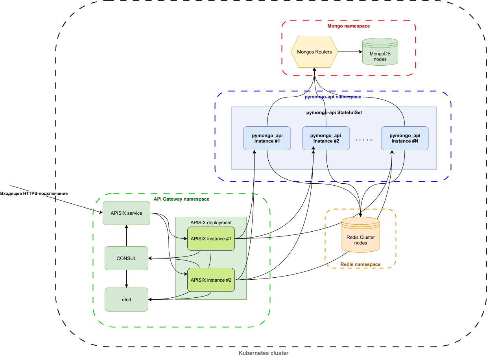

# Задание 5. Service Discovery и балансировка с API Gateway

В этой задаче мы добавим APISIX и CONSUL, а также горизонтальное масштабирование экземпляров `pymongo_api`;
- пространства `mongo` и `redis` показаны упрощённо;
- пространство `pymongo-api`:
  - добавлен StatefulSet, разворачивающий несколько экземпляров приложения `pymongo-api`,
  - количество экземлпяровбудем выставлять вручную (в будущем можно настроить HPA, но чтобы это делать, нужно сперва подготовить нагрузочные тесты);
  - headless-сервисы для экземпляров `pymongo_api` на схеме не показывал, но в реальности они тоже будут;
- добавляем пространство `api-gateway`:
  - добавим Deployment с 2 инстансами APISIX, а также CONSUL и etcd для хранения настроек.
  - добавим сервис APISIX.

На перспективу -- стоит задуматься над тем, чтобы перейти или на istio (отличные средства мониторинга), или на NGINX Ingress Controller (производительность).
